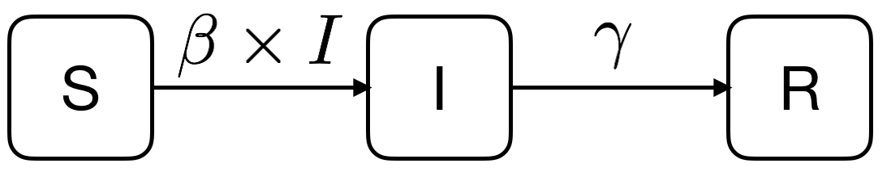

<!--
IMAGES:
Insert them with: 
You can also resize them if needed: convert image.png -resize 50% image.png
If you want to center the image, go through HTML code:
<div style="text-align:center"></div>

REFERENCES:
For references: Put all the bibTeX references in the file "references.bib"
in the current folder and cite the references as @key or [@key] in the text.
Uncomment the bibliography field in the above header and put a "References"
title wherever you want to display the reference list.
-->

```{r general_options, include = FALSE}
knitr::knit_hooks$set(margin = function(before, options, envir) {
  if (before) par(mgp = c(1.5, .5, 0), bty = "n", plt = c(.105, .97, .13, .97))
  else NULL
})

knitr::opts_chunk$set(margin = TRUE, prompt = FALSE, comment = "##",
                      collapse = FALSE, cache = FALSE, autodep = TRUE,
                      dev.args = list(pointsize = 11), fig.height = 3.5,
                      fig.width = 4.24725, fig.retina = 2, fig.align = "center")

l <- "en_US.UTF-8"
Sys.setenv(LANGAGE = l)
Sys.setlocale(locale = l)
Sys.setlocale("LC_MESSAGES", l)

# cleaning the packages space:
search_path <- search()
pkgs <- c("stats", "graphics", "grDevices", "utils", "datasets", "methods", "base")
tdet <- grep("package", search_path[!(search_path %in% paste0("package:", pkgs))],
             value = TRUE)
for(i in tdet) detach(i, unload = TRUE, character.only = TRUE)

rm(list = ls())
```

## Three representations of an SIR model

### A verbal description
Let's consider $S$ susceptibles, $I$ infectious and $R$ recovered. Susceptibles
become infected at a rate equal to the product of an infectious contact rate
$\beta$ and the number of infectious $I$. Infectious people recover at a rate 
$\gamma$.

### A graphical description

We could sketch the above verbal description as follows:

<div style="text-align:center"></div>

We have 3 **variables** $S$, $I$ and $R$ which are respectively the numbers of
susceptibles, infectious and recovered, and we have 2 **parameters** $\beta$ and
$\gamma$ which are respectively the infectious contact rate and the recovery
rate.

### A mathematical description

A mathematical description of the above SIR model using the differential
equations formalism looks like:

$$
\frac{dS}{dt} = -\beta \times I \times S\\
\frac{dI}{dt} =  \beta \times I \times S - \gamma\times I\\
\frac{dR}{dt} = \gamma\times I
$$

The basic reproductive ratio R$_0$ for this system is

$$
\mbox{R}_0 = \frac{\beta}{\gamma}N
$$


## Solving differential equations in R

Solving a system of differential equations means finding the values of the
variables (here $S$, $I$ and $R$) at a number of points in time. These values
will depend on the parameters' values. We can numerically solve differential
equations in R thanks to the `ode()` function of the `deSolve` package. If this
package is not installed  on your system, you need to install it:

```{r eval = FALSE}
install.packages("deSolve")
```

To be able to use the `deSolve` package, you need to load it:

```{r}
library(deSolve) # using the "ode" function
```

### Step 1: writing the differential equations in R

Note the use of the `with()` function in the function below:

```{r}
sir_equations <- function(time, variables, parameters) {
  with(as.list(c(variables, parameters)), {
    dS <- -beta * I * S
    dI <-  beta * I * S - gamma * I
    dR <-  gamma * I
    return(list(c(dS, dI, dR)))
  })
}
```

`with()` works on lists only, not on vectors.

### Step 2: defining some values for the parameters

Parameters values need to be defined in a named vector:

```{r}
parameters_values <- c(
  beta  = 0.004, # infectious contact rate (/person/day)
  gamma = 0.5    # recovery rate (/day)
)
```

Don't forget to document your code. Important information is the units of your
parameters!

### Step 3: defining initial values for the variables

The initial values of the variables need to be defined in a named vector:

```{r}
initial_values <- c(
  S = 999,  # number of susceptibles at time = 0
  I =   1,  # number of infectious at time = 0
  R =   0   # number of recovered (and immune) at time = 0
)
```

### Step 4: the points in time where to calculate variables values

We want to know the values of our SIR model variables at these time points:

```{r}
time_values <- seq(0, 10) # days
```

### Step 5: numerically solving the SIR model

We have defined all the needed ingredients:

```{r}
ls()
```

You can have a look at what is in these objects by typing their names at
the command line:

```{r}
sir_equations
parameters_values
initial_values
time_values
```

Everything looks OK, so now we can use the `ode()` function of the `deSolve` package to numerically solve our model:

```{r}
sir_values_1 <- ode(
  y = initial_values,
  times = time_values,
  func = sir_equations,
  parms = parameters_values 
)
```

We can have a look at the calculated values:

```{r}
sir_values_1
```

and you can use these values for further analytical steps, for examples making
a figure of the time series. To make our life easier, let's just first convert
`sir_values_1` into a data frame so that can then use it within the `with()`
function:

```{r}
sir_values_1 <- as.data.frame(sir_values_1)
sir_values_1
```

Same, same (almost). One handy difference is that now we can use the `with()`
function, which makes the code simpler:

```{r}
with(sir_values_1, {
# plotting the time series of susceptibles:
  plot(time, S, type = "l", col = "blue",
       xlab = "time (days)", ylab = "number of people")
# adding the time series of infectious:
  lines(time, I, col = "red")
# adding the time series of recovered:
  lines(time, R, col = "green")
})

# adding a legend:
legend("right", c("susceptibles", "infectious", "recovered"),
       col = c("blue", "red", "green"), lty = 1, bty = "n")
```

The value of the $R_0$ is

```{r eval = FALSE}
(999 + 1) * parameters_values["beta"] / parameters_values["gamma"]
```

```{r echo = FALSE}
unname((999 + 1) * parameters_values["beta"] / parameters_values["gamma"])
```


## Exercises

### Writing a simulator

Use some of the above code to write a `sir_1()` function that takes

* parameters values,
* intial values of the variables and
* a vector of time points

as inputs and run the SIR model and returns a data frame of time series as an
output as below:

```{r include = FALSE}
sir_1 <- function(beta, gamma, S0, I0, R0, times) {
  require(deSolve) # for the "ode" function
  
# the differential equations:
  sir_equations <- function(time, variables, parameters) {
    with(as.list(c(variables, parameters)), {
      dS <- -beta * I * S
      dI <-  beta * I * S - gamma * I
      dR <-  gamma * I
      return(list(c(dS, dI, dR)))
    })
  }
  
# the parameters values:
  parameters_values <- c(beta  = beta, gamma = gamma)

# the initial values of variables:
  initial_values <- c(S = S0, I = I0, R = R0)
  
# solving
  out <- ode(initial_values, times, sir_equations, parameters_values)

# returning the output:
  as.data.frame(out)
}
```

```{r}
sir_1(beta = 0.004, gamma = 0.5, S0 = 999, I0 = 1, R0 = 0, times = seq(0, 10))
```

